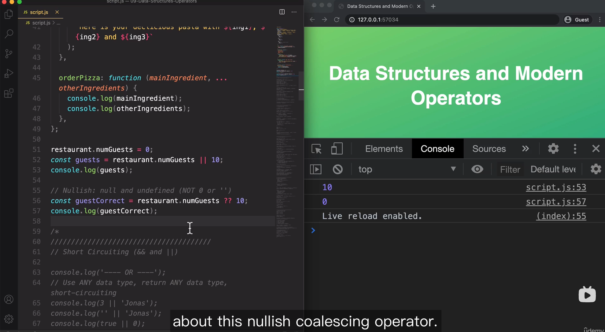

## HOW JAVASCRIPT WORKS BEHIND THE SCENES

### Hoisting 


- function expressions and arrows with let / const will not be hoisted and fall into TDZ
- function expressions and arrows with var will show 'is not a function' because var will be undefined


### this	keyword


- window object doesn't have a property called firstName thus will show undefined


- as long as it is a regular function call, then the this keyword would just be undefined no matter where the function call is located
- to fix this, simply rewrite the function using arrow functions, in that way the function will borrow this keyword from its parent scope 


### Copying objects

#### Object.assign


- cannot copy objects within objects


#### deep clone

```javascript
// deep clone
function deepClone(obj) = {
	const result = {};
	for (const key in obj) {
		if (typeof object[key] === 'object') {
      result[key] = deepClone(obj[key]);
    } else {
      result[key] = obj[key];
    }
	}
	return result;
}
```


## DATA STRUCTURES, MODERN OPERATORS AND STRINGS

### Destructoring arrays, spread & rest

- you can assign whatever name you want when destructuring arrays
- you should quote the exact same property name when destructuring objects


### && and ||

#### || 

- returns the first truthy value or the last value if no truthy presented 


 

#### && 

- returns the first falsy  value or the last value if no falsy value presented 


 

#### nullish coalscing operator

 

 

#### || && nullish assignment operator


### for of loop

- use .entries() to get the index in a for of loop 


### Set

- CRUD
- convert array to set and vice versa


### Map

- CRUD
- chaining set


### Functions

#### Default parameters 


#### Callback functions

- functions that accept other functions as parameters


- functions that return functions 


#### the call & apply methods

- .call(this, parameter1, parameter2....)
- .apply(this, [paramter1, parameter2])


 

 

 

- .bind(this)


 

- With event listeners, remember always set this keyword with bind method, otherwise the this keyword will point to the element in the DOM(button )


- partial application, we can create a more specific function based on a more general function using bind method or we can simply create the function with nested function returning
- addTax() - general ; addVAT() - specific tax with 0.23 as rate 


### Immediately Invoked Function Expressions (outdated)

- Use () to surround the function with another pair of () following


### Closure


- Closure wil remember the new environment once being re-assigned


- setTimeout was executed completely independently since its parent function has been executed right away, but setTimeout still remembers all the variables after three seconds
- closure has a higher priority than globle scope, functions will always look for variables in the closures first 


- even though the following function will be immediately executed, the eventListener has successfully attached to the body element, and thanks to closure, the eventListener can still visit header variable in its parent scope thus turning the header to blue. 


## ARRAYS

- array.slice() doesn't mutate the orginal array 
- [...arr] the spread operator also creates a shallow copy of the original array 
- array.splice() will alter the original array
- array.reverse() will alter the original array 
- array.concat(arr2) doesn't mutate the orginal array
- array.at(index) is a ES2022 new feature that accepts negative values and is compatible with method chaining


#### forEach

- array.forEach(element, index, array) the order of inputs matter
- break & continue keywords doesn't work for forEach


- map.forEach(value, key, map)
- set.forEach(value, key, map) for set the value and the key will be the same, you can use an underscore '_' to indicate a throwaway variable


 

#### map / filter / reduce


#### map


#### find 

- filter returns an array, find returns the first element that meets the condition


#### includes / some / every 


#### flat / flatMap


#### sorting 


#### create arrays

 


#### summary


#### practice


 