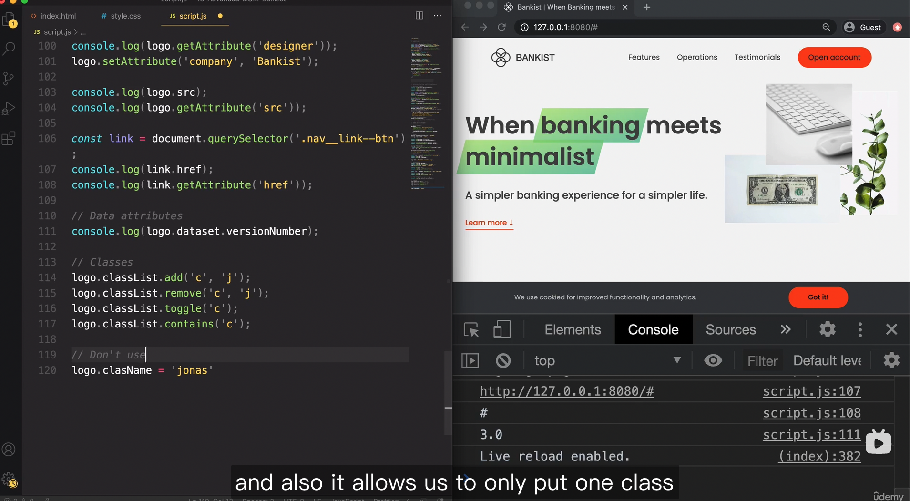
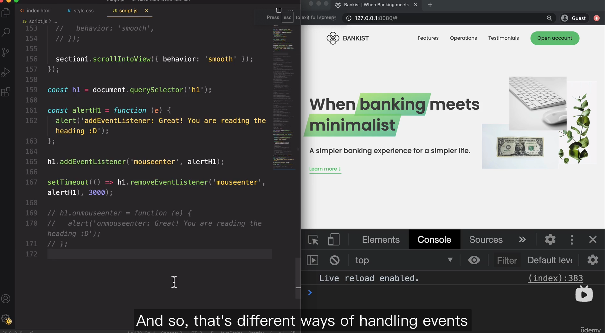
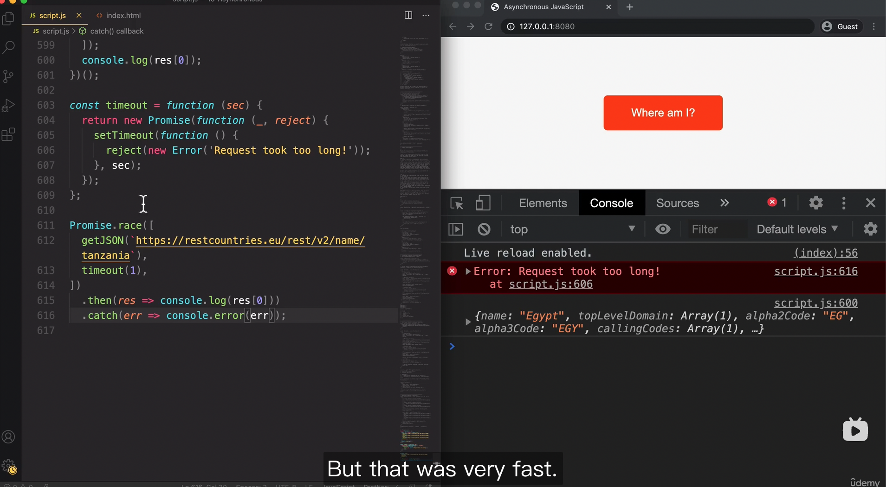
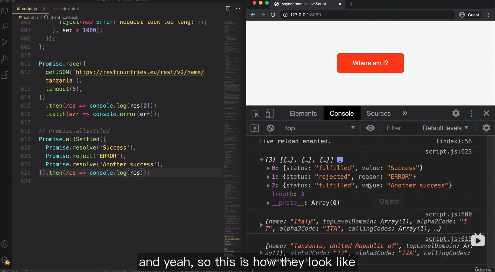

## HOW JAVASCRIPT WORKS BEHIND THE SCENES

### Hoisting 


- function expressions and arrows with let / const will not be hoisted and fall into TDZ
- function expressions and arrows with var will show 'is not a function' because var will be undefined


### this	keyword


- window object doesn't have a property called firstName thus will show undefined


- as long as it is a regular function call, then the this keyword would just be undefined no matter where the function call is located
- to fix this, simply rewrite the function using arrow functions, in that way the function will borrow this keyword from its parent scope 


### Copying objects

#### Object.assign


- cannot copy objects within objects


#### deep clone

```javascript
// deep clone
function deepClone(obj) = {
	const result = {};
	for (const key in obj) {
		if (typeof object[key] === 'object') {
      result[key] = deepClone(obj[key]);
    } else {
      result[key] = obj[key];
    }
	}
	return result;
}
```


## 09.DATA STRUCTURES, MODERN OPERATORS AND STRINGS

### Destructoring arrays, spread & rest

- you can assign whatever name you want when destructuring arrays
- you should quote the exact same property name when destructuring objects


### && and ||

#### || 

- returns the first truthy value or the last value if no truthy presented 


 

#### && 

- returns the first falsy  value or the last value if no falsy value presented 


 

#### nullish coalscing operator

 

 

#### || && nullish assignment operator


### for of loop

- use .entries() to get the index in a for of loop 


### Set

- CRUD
- convert array to set and vice versa


### Map

- CRUD
- chaining set


## 10.FUNCTIONS

### Default parameters 


### Callback functions

- functions that accept other functions as parameters


- functions that return functions 


### the call & apply methods

- .call(this, parameter1, parameter2....)
- .apply(this, [paramter1, parameter2])


 

 

 

- .bind(this)


 

- With event listeners, remember always set this keyword with bind method, otherwise the this keyword will point to the element in the DOM(button )


- partial application, we can create a more specific function based on a more general function using bind method or we can simply create the function with nested function returning
- addTax() - general ; addVAT() - specific tax with 0.23 as rate 


### Immediately Invoked Function Expressions (outdated)

- Use () to surround the function with another pair of () following


### Closure


- Closure wil remember the new environment once being re-assigned


- setTimeout was executed completely independently since its parent function has been executed right away, but setTimeout still remembers all the variables after three seconds
- closure has a higher priority than globle scope, functions will always look for variables in the closures first 


- even though the following function will be immediately executed, the eventListener has successfully attached to the body element, and thanks to closure, the eventListener can still visit header variable in its parent scope thus turning the header to blue. 


## 11.ARRAYS

- array.slice() doesn't mutate the orginal array 
- [...arr] the spread operator also creates a shallow copy of the original array 
- array.splice() will alter the original array
- array.reverse() will alter the original array 
- array.concat(arr2) doesn't mutate the orginal array
- array.at(index) is a ES2022 new feature that accepts negative values and is compatible with method chaining


### forEach

- array.forEach(element, index, array) the order of inputs matter
- break & continue keywords doesn't work for forEach


- map.forEach(value, key, map)
- set.forEach(value, key, map) for set the value and the key will be the same, you can use an underscore '_' to indicate a throwaway variable


 

### map / filter / reduce


### map


### find 

- filter returns an array, find returns the first element that meets the condition


### includes / some / every 


### flat / flatMap


### sorting 


### create arrays

 


### summary


### practice


 

## 12.NUMBERS / DATES/ TIMERS

### converting / checking numbers 


### Math / rounding


### BigInt


 

### Dates


 

### Timer / setTimeout / setInterval


## 13.DOM

### selecting / creating / deleting elements

- .getElementsByTagName & .getElementsByClassName both return an automatically updated HTML collection


- prepend - insert element as the first child of the selected element
- append - insert element as the last child of the slected element
- remove - parentElement.removeChild - these two are the same, remove is a more recent feature


### styles / attributes / classes

- use getAttribute to get non-standard attributes aka customed attributes
- getAttribute - gets you the relative path, dot notation gets you the absolute path


- don't use .className to modify class names, it only allows one existing class name and will override all other names.




### smooth scrolling


### types of event handlers

- addEventListener is the preferred way because:
  - it allows us to add multiple events to one element
  - it allows us to remove events
- on(mouseenter) this syntax is depercated
- defining in HTML is also depercated




### bubbling / capturing

- capturing phase - when an eventListener is created, it will be firstly created at the root element, it then travels to the target element one by one
- target phase - the phase that the eventListener actually reaches the target element
- bubbling phase - the eventListener will then travels back to the root element
- eventListeners only traverse between direct parent elements rather than sibling elements
- not all events have these phases


### event delegation

- the idea is we only add one event listener to the parent element when there are way too many child elements that trigger the event
- pay attention, we are not add events to the element but event listeners. the event will bubble up to the parent elemnt from the child element, and the event listener will catch it
- by doing this, we can same a lot of memory, improve performace, and make our event listeners more dynamic since we might add new child elements


### DOM traversing

- we use methods that retrieve elements more often than the ones that retrieve nodes


### defer / async script loading


 


## 14.OOP


### prototypes


### creating classes

- function constructors - outdated


- ES6 classes


- first class citizen means that classes can be passed in as parameters and can be returned


  

### getter / setter

- objects


- classes 
- there be a conflict if we want to set the same property name with setters, add an underscore in front to prevent this conflict
- but doing this will create a new property which override the previous property 


### Inheritance

- constructor functions
- need to manually set constructor


- ES6 classes
- extends / super keywords


- create prototype chain using Object.create 


 

### encapsulation


 

- fields ending with ;
- fields are created on  the instance instead of in the prototype
- use # for private field 


 

### chaining methods

- return this in each method so we get access to the current object


 

### summary


 

16.ASYNCHRONOUS


 

- synchronous > micro-task queue > callbacks


 

### parallel promises

- Promise.all() combinator
- if one promise rejects, the whole promise rejects as well 


 


- Promise.race()
- only gets the first one who wins the race no matter the promise rejects or fullfills
- we can use this characteristic to create a timeout function which prevents users wait too long for loading the page

 


- Promise.allSettled()
- return all values even if there will be rejected ones




-  Promise.any()
- return the first fullfilled value


17.MODERN JS MODEL TOOLING

### modules


- all modules are run in strict mode by default
- all import statements are hoisted


### top-level await

- we can use top level await in modules
- it will return the actual data instead of the promise 


### command line

- ls - show all files
- cd - go to the selected directory
- cd .. - go up
- cd ../.. go up twice
- clear / cmd + k - clear output
- mkdir - make new folder
- touch - make new files
- touch file1 file2 file3 - create multiple files
- rm - delete files
- mv fileName location - move file to the assigned location
- rmdir - delete empty folders
- rm -R - delete recursively all files in a folder(included)